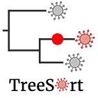
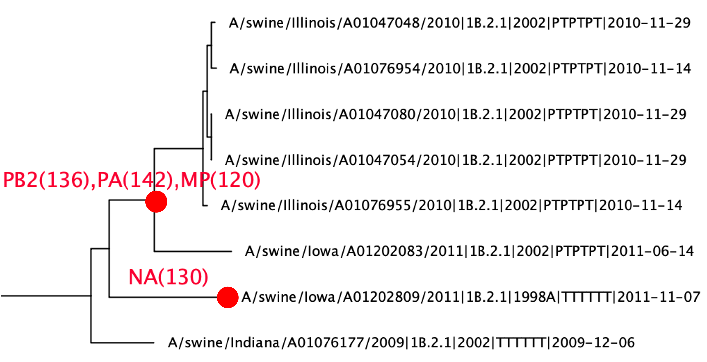

# TreeSort #



TreeSort infers both recent and ancestral reassortment events along the branches of a phylogenetic tree of a fixed genomic segment.
It uses a statistical hypothesis testing framework to identify branches where reassortment with other segments has occurred and reports these events.

<!-- The idea behind TreeSort is the observation that *if there is no reassortment, then the evolutionary histories of different segments should be identical*. TreeSort then uses a phylogenetic tree for one segment (e.g., the HA influenza A virus segment) as an evolutionary hypothesis for another segment (e.g., the NA segment). We will refer to the first segment as the *reference* and the second segment as the *challenge*. By trying to fit the sequence alignment of the challenge segment to the reference tree, TreeSort identifies points on that tree, where this evolutionary hypothesis breaks. The "breaking" manifests in the mismatch between the divergence time on the reference tree (e.g., 1 year divergence between sister clades) and an unlikely high number of substitutions in the challenge segment that are required to explain the reference tree topology under the null hypothesis of no reassortment.

TreeSort has demonstrated very high accuracy in reassortment inference in simulations (manuscript in preparation). TreeSort can process datasets with tens of thousands of virus strains in just a few minutes and can scale to very large datasets with hundreds of thousands of strains. -->

Below is an example of 2 reassortment events inferred by TreeSort on a swine H1 dataset. The reference phylogeny is the hemagglutinin (HA) segment tree, and the branch annotations indicate reassortment relative to the HA's evolutionary history. The annotations list the acquired gene segments and how distant these segments were (# of nucleotide differences) from the original segments. For example, `PB2(136)` indicates that a new PB2 was acquired that was approximately 136 nucleotides different from the pre-reassortment PB2.

<!--  -->
<center>

</center>

### Citation ###
**If you use TreeSort, please cite it as**</br>
*Markin, A., Macken, C.A., Baker, A.L., and Anderson, T.K. Revealing reassortment in influenza A viruses with TreeSort. bioRxiv 2024.11.15.623781; [doi: https://doi.org/10.1101/2024.11.15.623781](https://doi.org/10.1101/2024.11.15.623781).*

N.B. TreeSort uses TreeTime in a subroutine to infer substitution rates for segments - please also cite *Sagulenko et al. 2018 [doi: 10.1093/ve/vex042](https://doi.org/10.1093/ve/vex042).*

### Installation ###
For a default installation, run `pip install treesort`. Alternatively, you can download this repository and run `pip install .` from within the downloaded directory. TreeSort requires **Python 3** to run and depends on SciPy, BioPython, DendroPy, and TreeTime (these dependencies will be installed automatically).

For a broader installation of the bioinformatics suite required to align sequences and build phylogenetic trees via the [prepare_dataset.sh](prepare_dataset.sh) script that we provide, we recommend using a conda environment that can be set up as follows.

If you haven't already, configure bioconda.
```
conda config --add channels bioconda
conda config --add channels conda-forge
conda config --set channel_priority strict
```
Then create a new environment with required dependencies and install TreeSort inside that environment.
```
git clone https://github.com/flu-crew/TreeSort.git
cd TreeSort
conda create -n treesort-env --file conda-requirements.txt
conda activate treesort-env
pip install .
<Run TreeSort on your data>
conda deactivate
```


## Tutorial ##
We use a swine H1 influenza A virus dataset for this tutorial. We include only HA and NA gene segments in this analysis for simplicity, but it can be expanded to all 8 segments. <!-- The segment trees and alignments for HA and NA can be found in the tutorial [folder](tutorial/swH1-dataset/).  -->
**Please note** that all sequences should have the dates of collection included in the deflines, and all metadata fields should be separated by "|". E.g., "A/swine/Iowa/A02934932/2017|1A.3.3.2|2017-05-12".

To start, we will install TreeSort using the conda method above
```
git clone https://github.com/flu-crew/TreeSort.git  # Download this repo
cd TreeSort
conda create -n treesort-env --file conda-requirements.txt  # Create a new conda env and install dependencies
conda activate treesort-env
pip install .  # Install TreeSort
```

### Creating a descriptor file ###

The input to TreeSort is a **descriptor** file, which is a comma-separated csv file that describes where the alignments and trees for individual segments can be found. Here is an [example descriptor file](examples/descriptor-huH1N1-wgs.csv). For our case, the descriptor file could look as follows (the column headings should not be included):

| segment name | path to the fasta alignment | path to the newick-formatted tree |
| --- | --- | --- |
| *HA | HA-swine_H1_HANA.fasta.aln | HA-swine_H1_HANA.fasta.aln.rooted.tre
| NA | NA-swine_H1_HANA.fasta.aln | NA-swine_H1_HANA.fasta.aln.rooted.tre

The star symbol (\*) indicates the segment that will be used as the reference phylogeny and reassortment events will be inferred relative to this phylogeny (HA in this case). Note that the reference phylogeny should be **rooted**, whereas trees for other segments can be unrooted. <!-- (see [TreeTime](https://github.com/neherlab/treetime) for good rooting options for RNA viruses). -->

We will use [prepare_dataset.sh](prepare_dataset.sh) bash script to automatically build alignments and trees for two segments in our swine dataset and compile a descriptor file. The script relies on the fact that every sequence has a segment name in the middle of the defline (e.g., |HA| or |4|).
<!-- However, if you already have trees and alignments built for your own dataset, you can create the descriptor manually following this [example](examples/descriptor-huH1N1-wgs.csv). -->

<!-- The descriptor can be automatically generated using the [prepare_dataset.sh](prepare_dataset.sh) bash script that can be found in the repository. The script requires a single fasta file that contains the segment sequences as input. -->

```
./prepare_dataset.sh --fast --segments "HA,NA" tutorial/swH1-dataset/swine_H1_HANA.fasta HA tutorial/swH1-parsed
```
To make things faster, we use the `--fast` flag here so that all trees are built using FastTree. However, we do not recommend to use this flag for high-precision analyses. When this flag is not used, the script will build the reference phylogeny using IQ-Tree, which will be slower but will likely result in a better quality tree, and therefore more accurate reassortment inference.

The required arguments to the script are the path to the main fasta file, name of the regerence segment, and the path to the output directory. If `--segments` are not specified, the script assumes that 8 IAV segment names should be used (PB2, PB1, PA, HA, NP, NA, MP, NS).

Running the above command will save the descriptor file, all trees, and alignments to the `tutorial/swH1-parsed` directory. Note that if for your data you already have trees built, you can manually create the descriptor file without using the script.


### Running TreeSort ###
First make sure to familiarize yourself with the options available in the tool by looking through the help message.
```
treesort -h
```

Having the descriptor file from above, TreeSort can be run as follows
```
cd tutorial/swH1-parsed/
treesort -i descriptor.csv -o swH1-HA.annotated.tre
```
To run the newest mincut algorithm for reassortment inference (see details [here](https://github.com/flu-crew/TreeSort/releases/tag/0.3.0)), please use
```
treesort -i descriptor.csv -o swH1-HA.annotated.tre -m mincut
```

TreeSort will first estimate molecular clock rates for each segment and then will infer reassortment and annotate the backbone tree. The output tree in nexus format (`swH1-HA.annotated.tre`) can be visualized in FigTree or [icytree.org](https://icytree.org/). You can view the inferred reassortment events by displaying the **'rea'** annotations on tree edges, as shown in the Figure above.

In this example TreeSort identifies a total of 93 HA-NA reassortment events:
```
Inferred reassortment events with NA: 93.
Identified exact branches for 79/93 of them
```

Additionally, the method outputs the estimated reassortment rate per ancestral lineage per year. The rate translates to the probability of a single strain to undergo a reassortment event over the course of a year. In our case this probability of reassortment with NA is approximately 4%.

Below is a part of the TreeSort output, where we see two consecutive NA reassortment events. The NA clade classifications were added to the strain names so that it's easier to interpret these reassortment events. Here we had a 2002 NA -> 1998A NA switch, followed by a 1998A -> 2002B NA switch.
<center>

</center>

### Uncertain reassortment placement (the '?' tag) ###
Note that this section only applies to the `-m local` inference method (the default method for TreeSort). The `-m mincut` method always infers certain reassortment placements.

Sometimes TreeSort does not have enough information to confidently place a reassortment event on a specific branch of the tree. TreeSort always narrows down the reassortment event to a particular ancestral node on a tree, but may not distinguish which of the child branches was affected by reassortment. In those cases, TreeSort will annotate both child branches with a `?<segment-name>` tag. For example, `?PB2(26)` below indicates that the reassortment with PB2 might have happened on either of the child branches.

<center>

</center>

Typically, this happens when the sampling density is low. Therefore, increasing the sampling density by including more strains in the analysis may resolve such instances.
