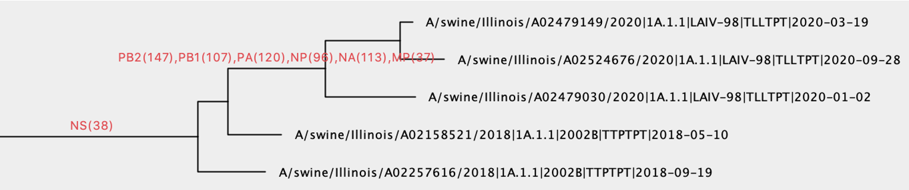
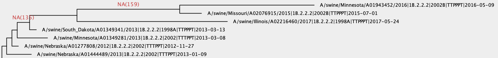
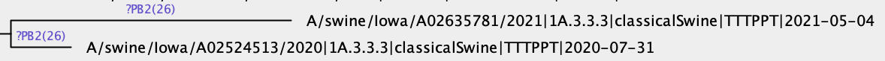

## TreeSort ##
TreeSort infers reassortment events along the branches of a fixed segment tree.
It uses a statistical hypothesis testing framework to identify branches where reassortment with other segments has occurred and reports these events.

The idea behind TreeSort is the observation that *if there is no reassortment, then the evolutionary histories of different segments should be identical*. TreeSort then uses a phylogenetic tree for one segment (e.g., an HA influenza A virus gene) as an evolutionary hypothesis for another segment (e.g., NA gene). We will refer to the first segment as the *reference* and the second segment as the *challenge*. By trying to fit the sequence alignment of the challenge segment to the reference tree, TreeSort identifies points on that tree, where this evolutionary hypothesis breaks. The "breaking" manifests in the mismatch between the divergence time on the reference tree (e.g., 1 year divergence between sister clades) and an unlikely high number of substitutions in the challenge segment that are required to explain the reference tree topology under the null hypothesis of no reassortment.

TreeSort has demonstrated a very high accuracy in reassortment inference in simulations (manuscript in preparation). TreeSort can process datasets with tens of thousands of virus strains in just a few minutes and can scale to very large datasets with hundreds of thousands of strains.

Below is an example of (a small part of) TreeSort output after it was run on an H1 influenza A virus in swine dataset. The reference phylogeny is a hemagglutinin (HA) segment tree and the annotations indicate reassortment relative to the HA's evolutionary history. The annotations list the acquired gene segments and how distant were these segments (# of nucleotide substitutions) from the original segments. For example, `PB2(147)` indicates that a new PB2 was acquired that was (at least) 147 nucleotides different from the pre-reassortment PB2.
<center>

</center>

### Installation ###
To install TreeSort you may download this repository and run `pip install .` from within the downloaded directory.

TreeSort requires **Python 3** to run and depends on SciPy, BioPython, DendroPy, and TreeTime (these dependencies will be installed automatically).

## Tutorial ##
We use a swine H1 influenza A virus dataset for this tutorial. We include only HA and NA gene segments in this analysis for simplicity, but it can be expanded to all 8 segments. The segment trees and alignments for HA and NA can be found in the tutorial [folder](tutorial/swH1-dataset/). **Please note** that the strain names should fully match across different segments and across alignments and trees.

The input to the program is a **descriptor** file, which is a comma-separated csv file that describes where the gene segments' data can be found. Here is an [example descriptor file](examples/descriptor-huH1N1-wgs.csv).

The descriptor file for our dataset looks as follows (the column headings are not required within the descriptor file):

| segment name | path to the fasta alignment | path to the newick-formatted tree |
| --- | --- | --- |
| *HA | swH1-dataset/HA-swH1.cds.aln | swH1-dataset/HA-swH1.rooted.tre |
| NA | swH1-dataset/NA-swH1.cds.aln | swH1-dataset/NA-swH1.tre |


Here the star symbol (\*) indicates the segment that will used as the backbone phylogeny - reassortment events will be inferred relative to this phylogeny (HA in this case). Note that the backbone phylogeny should be **rooted**, whereas trees for other segments can be unrooted (see [TreeTime](https://github.com/neherlab/treetime) for good rooting options for RNA viruses).
The csv descriptor file for the above table should not contain the header, and it can be found [here](tutorial/descriptor-swH1-HANA.csv).

Having the descriptor file, TreeSort can be run as follows (from within the tutorial folder)
```
treesort -i descriptor-swH1-HANA.csv -o swH1-HA.annotated.tre
```
TreeSort will first estimate molecular clock rates for each segment and then will infer reassortment and annotate the backbone tree. The output tree in nexus format (`swH1-HA.annotated.tre`) can be visualized in FigTree or [icytree.org](https://icytree.org/). You can view the inferred reassortment events by displaying the **'rea'** annotations on tree edges, as shown in the Figure above.

In this example TreeSort identifies a total of 130 HA-NA reassortment events:
```
Total HA-NA reassortment events: 130.
Identified exact branches for 104/130 of them
```

Below is a part of the TreeSort output, where we see two consecutive NA reassortment events. The NA clade classifications were added to the strain names so that it's easier to interpret these reassortment events. Here we had a 2002 NA -> 1998A NA switch, followed by a 1998A -> 2002B NA switch.
<center>

</center>

### Uncertain reassortment placement (the '?' tag) ###
Sometimes TreeSort does not have enough information to confidently place a reassortment event on a specific branch of the tree. TreeSort always narrows down the reassortment event to a particular ancestral node on a tree, but may not distinguish which of the child branches was affected by reassortment. In those cases, TreeSort will annotate both child branches with a `?<segment-name>` tag. For example, `?PB2(26)` below indicates that the reassortment with PB2 might have happened on either of the child branches.

<center>

</center>

Typically, this happens when the sampling density is low. Therefore, increasing the sampling density by including more strains in the analysis may resolve such instances.
